# Дипломный практикум в YandexCloud
  * [Цели:](#цели)
  * [Этапы выполнения:](#этапы-выполнения)
      * [Регистрация доменного имени](#регистрация-доменного-имени)
      * [Создание инфраструктуры](#создание-инфраструктуры)
          * [Установка Nginx и LetsEncrypt](#установка-nginx)
          * [Установка кластера MySQL](#установка-mysql)
          * [Установка WordPress](#установка-wordpress)
          * [Установка Gitlab CE, Gitlab Runner и настройка CI/CD](#установка-gitlab)
          * [Установка Prometheus, Alert Manager, Node Exporter и Grafana](#установка-prometheus)
  * [Что необходимо для сдачи задания?](#что-необходимо-для-сдачи-задания)
  * [Как правильно задавать вопросы дипломному руководителю?](#как-правильно-задавать-вопросы-дипломному-руководителю)

---
## Цели:

1. Зарегистрировать доменное имя (любое на ваш выбор в любой доменной зоне).
2. Подготовить инфраструктуру с помощью Terraform на базе облачного провайдера YandexCloud.
3. Настроить внешний Reverse Proxy на основе Nginx и LetsEncrypt.
4. Настроить кластер MySQL.
5. Установить WordPress.
6. Развернуть Gitlab CE и Gitlab Runner.
7. Настроить CI/CD для автоматического развёртывания приложения.
8. Настроить мониторинг инфраструктуры с помощью стека: Prometheus, Alert Manager и Grafana.

---
## Этапы выполнения:

### Регистрация доменного имени

Цель:

1. Получить возможность выписывать [TLS сертификаты](https://letsencrypt.org) для веб-сервера.

Ожидаемые результаты:

1. У вас есть доступ к личному кабинету на сайте регистратора.
2. Вы зарезистрировали домен и можете им управлять (редактировать dns записи в рамках этого домена).

__Ответ__

домен avkorsh.ru регистрировал на https://www.webnames.ru 
в панели управления перевеле на dns сервера YandexCloud

### Создание инфраструктуры

Предварительная подготовка:

1. Создайте сервисный аккаунт, который будет в дальнейшем использоваться Terraform для работы с инфраструктурой с необходимыми и достаточными правами. Не стоит использовать права суперпользователя

__Ответ__

```bash
vagrant@vagrant:~$ yc iam service-account create --name korsh-diplom
id: aje1ccbvogtjcv59e0l9
folder_id: b1g1kjojfaduldiklc0o
created_at: "2022-07-14T10:37:19.033081386Z"
name: korsh-diplom

export  FOLDER_ID=b1g1kjojfaduldiklc0o
export  SERVICE_ACCOUNT_ID=aje1ccbvogtjcv59e0l9

#дадим права editor, storage.viewer, vpc.admin

yc resource-manager folder add-access-binding $FOLDER_ID \
    --subject serviceAccount:$SERVICE_ACCOUNT_ID \
    --role editor
yc resource-manager folder add-access-binding $FOLDER_ID \
    --subject serviceAccount:$SERVICE_ACCOUNT_ID \
    --role vpc.admin
yc resource-manager folder add-access-binding $FOLDER_ID \
    --subject serviceAccount:$SERVICE_ACCOUNT_ID \
    --role storage.viewer 

#создадим ключ доступа
yc iam key create --service-account-name korsh-diplom --output key.json
# перейдем в другой профиль для работы под сервисным акаунтом
yc config profile create sa-dipl-profil
```

2. Подготовьте [backend](https://www.terraform.io/docs/language/settings/backends/index.html) для Terraform:
   а. Рекомендуемый вариант: [Terraform Cloud](https://app.terraform.io/)  
   б. Альтернативный вариант: S3 bucket в созданном YC аккаунте.

__Ответ__

используем бакет tf-back-korsh-diplom, проще его заранее создать через веб-интерфейс
получаем секретные ключи - нужны для использования бакета как бэкэнда

```
$ yc iam access-key create --service-account-name korsh-diplom
access_key:
  id: ajefqt3rnejq6isbmri7
  service_account_id: aje1ccbvogtjcv59e0l9
  created_at: "2022-07-14T11:22:54.114922769Z"
  key_id: ...
  secret: ...
```

всю инфраструктуру описал в одном tf файле -  [here](/terraform/main.tf)

В переменных использовал только cloud_id, folder_id, service_account_id
Также предварительно зарезервировал внешний ip, и явно указывал его для выделения основному хосту с nginx.

Основные блоки этого пункта в main.tf
 - locals - переменные, используемые в коде
 - terraform - указание на yandex конфигурация backend, также необходимо явно указать статические ключи, причем не дает использовать как переменную


3. Настройте [workspaces](https://www.terraform.io/docs/language/state/workspaces.html)
   а. Рекомендуемый вариант: создайте два workspace: *stage* и *prod*. В случае выбора этого варианта все последующие шаги должны учитывать факт существования нескольких workspace.  
   б. Альтернативный вариант: используйте один workspace, назвав его *stage*. Пожалуйста, не используйте workspace, создаваемый Terraform-ом по-умолчанию (*default*).

__Ответ__

использовал один workspace, переключение на него произошло по команде `terraform workspace new stage`

4. Создайте VPC с подсетями в разных зонах доступности.

__Ответ__

В рамках данного этапа также необходимо настроить DNS
- создается зона с зарегистрованным доменом 
- создал 2 записи avkorsh.ru. и *.avkorsh.ru. , в записях использовадл зарезервированный ip

В рамках создания VPC:
- создал сеть - указывается просто имя `korsh-net`
- три подсети - с явно выделенным диапазонами внутренних ip (a - 192.168.101.0/24, и - 192.168.102.0, с -192.168.103.0)
- для всех узлов использовал фиксированные внутренние ip, для сервер доступного снаружи использовал внутренний ip 192.168.101.100
- создал статический маршрут по всей сети, но чтобы он работал нужно при установке nginx на прокси  включить `net.ipv4.ip_forward` + `iptables -t nat -A POSTROUTING -o eth0 -j MASQUERADE`

```
 static_route {
    destination_prefix = "0.0.0.0/0"
    next_hop_address   = "192.168.101.100"
```


- далее описывал виртуальные машины - всего 6 штук, на каждую писал отдельный блок. При описании использовал совпадающие hostname и name, а также фиксированный внутренний ip, на всех машинах кроме прокси, нет внешнего ip. 
- Все машины кроме db02 в одной подсети (tf-korsh-subnet-a), db02 в tf-korsh-subnet-b.
- id образа взял  из доступных стандартных образов ubuntu 20.04  `yc compute image list --folder-id standard-images`
  
   * nginx 2ядра/2ГБ/20%  192.168.101.100, 62.84.126.100 
   * db01 2ядра/2ГБ/20%  192.168.101.101
   * db02 2ядра/2ГБ/20%  192.168.102.101
   * app 4ядра/4ГБ/20%  192.168.101.102
   * gitlab 4ядра/12ГБ/20%  192.168.101.103
   * monitoring 2ядра/2ГБ/20%  192.168.101.104

Также для подключения по ssh к узлам прописал в промежуточный узел в `~/.ssh/config` 

```
Host nginx
    HostName 62.84.126.100
    User ubuntu
    IdentityFile ~/.ssh/id_rsa
    StrictHostKeyChecking no
    UserKnownHostsFile=/dev/null

Host db01
   ProxyJump nginx
   HostName 192.168.101.101
   User ubuntu
   IdentityFile ~/.ssh/id_rsa
   StrictHostKeyChecking no
   UserKnownHostsFile=/dev/null

Host db02
   ProxyJump nginx
   HostName 192.168.102.101
...
Host app
   ProxyJump nginx
   HostName 192.168.101.102
...
Host gitlab
   ProxyJump nginx
   HostName 192.168.101.103
...

Host monitoring
   ProxyJump nginx
   HostName 192.168.101.104
...
```


5. Убедитесь, что теперь вы можете выполнить команды `terraform destroy` и `terraform apply` без дополнительных ручных действий.
6. В случае использования [Terraform Cloud](https://app.terraform.io/) в качестве [backend](https://www.terraform.io/docs/language/settings/backends/index.html) убедитесь, что применение изменений успешно проходит, используя web-интерфейс Terraform cloud.

> не использовал 

---


### Установка Nginx и LetsEncrypt


Необходимо разработать Ansible роль для установки Nginx и LetsEncrypt.

**Для получения LetsEncrypt сертификатов во время тестов своего кода пользуйтесь [тестовыми сертификатами](https://letsencrypt.org/docs/staging-environment/), так как количество запросов к боевым серверам LetsEncrypt [лимитировано](https://letsencrypt.org/docs/rate-limits/).**

Рекомендации:
  - Имя сервера: `you.domain`
  - Характеристики: 2vCPU, 2 RAM, External address (Public) и Internal address.

Цель:
1. Создать reverse proxy с поддержкой TLS для обеспечения безопасного доступа к веб-сервисам по HTTPS.

Ожидаемые результаты:

1. В вашей доменной зоне настроены все A-записи на внешний адрес этого сервера:
    - `https://www.you.domain` (WordPress)
    - `https://gitlab.you.domain` (Gitlab)
    - `https://grafana.you.domain` (Grafana)
    - `https://prometheus.you.domain` (Prometheus)
    - `https://alertmanager.you.domain` (Alert Manager)
2. Настроены все upstream для выше указанных URL, куда они сейчас ведут на этом шаге не важно, позже вы их отредактируете и укажите верные значения.
2. В браузере можно открыть любой из этих URL и увидеть ответ сервера (502 Bad Gateway). На текущем этапе выполнение задания это нормально!

__Ответ:__

Использовал готовую ansible роль с nginx и certbot. Основная конфигурация nginx ansible/roles/nginx/templates/nginx_vhosts.conf

пример настройки для одного сервера

```
upstream gitlab {
    server gitlab:80;
}

server {
  listen          443 ssl;
  server_name     gitlab.avkorsh.ru;

  ssl_certificate      /etc/letsencrypt/live/avkorsh.ru/fullchain.pem;
  ssl_certificate_key  /etc/letsencrypt/live/avkorsh.ru/privkey.pem;

  include              /etc/letsencrypt/options-ssl-nginx.conf;

  location / {
    proxy_pass         http://gitlab; ## имя хоcта или внутренний ip
    proxy_set_header   Host $host:$server_port;
    proxy_set_header   X-Real-IP $remote_addr;
    proxy_set_header   X-Forwarded-For $proxy_add_x_forwarded_for;
    proxy_set_header   X-Forwarded-Proto $scheme;
  }
}

```

Для установки certbot использовал package, запуск командой шелла, на этапе отладки аргумент `--staging `
___
### Установка кластера MySQL

Необходимо разработать Ansible роль для установки кластера MySQL.

Цель:

1. Получить отказоустойчивый кластер баз данных MySQL.

Ожидаемые результаты:

1. MySQL работает в режиме репликации Master/Slave.
2. В кластере автоматически создаётся база данных c именем `wordpress`.
3. В кластере автоматически создаётся пользователь `wordpress` с полными правами на базу `wordpress` и паролем `wordpress`.

__Ответ:__
Источник роли по установке - https://medium.com/@kelom.x/ansible-mysql-installation-2513d0f70faf
Репликация - https://github.com/geerlingguy/ansible-role-mysql/blob/master/tasks/replication.yml
Пользователь и БД создаются в основной роли, настройка репликации  выделена в отдельную

___
### Установка WordPress

Необходимо разработать Ansible роль для установки WordPress.

Рекомендации:
  - Имя сервера: `app.you.domain`
  - Характеристики: 4vCPU, 4 RAM, Internal address.

Цель:

1. Установить [WordPress](https://wordpress.org/download/). Это система управления содержимым сайта ([CMS](https://ru.wikipedia.org/wiki/Система_управления_содержимым)) с открытым исходным кодом.

Ожидаемые результаты:

1. Виртуальная машина на которой установлен WordPress и Nginx/Apache (на ваше усмотрение).
2. В вашей доменной зоне настроена A-запись на внешний адрес reverse proxy:
    - `https://www.you.domain` (WordPress)
3. На сервере `you.domain` отредактирован upstream для выше указанного URL и он смотрит на виртуальную машину на которой установлен WordPress.
4. В браузере можно открыть URL `https://www.you.domain` и увидеть главную страницу WordPress.

__Ответ:__

- используем nginx
- кофигурация БД прописываем в  шаблоне wp-config.php.j2
- DNS запись настраивается в CloudDNS с помощью terraform и привязана в внешнему ip
- конфиг nginx на прокси

```
upstream web {
    server app:80;
}

server {
  listen               443 ssl;
  server_name          avkorsh.ru www.avkorsh.ru;
  
  location / {
    proxy_set_header   Host $host;
    proxy_set_header   X-Real-IP $remote_addr;
    proxy_set_header   X-Forwarded-For $proxy_add_x_forwarded_for;
    proxy_set_header   X-Forwarded-Proto $scheme;
    proxy_pass         http://web;
  }

```

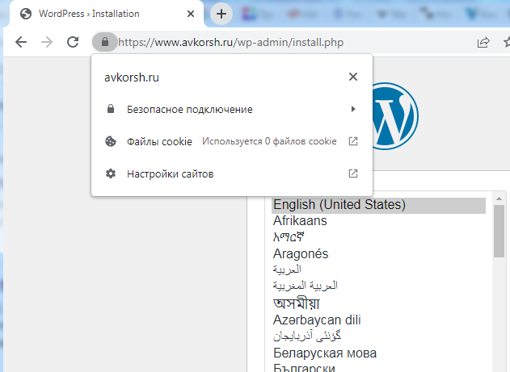  


---
### Установка Gitlab CE и Gitlab Runner

Необходимо настроить CI/CD систему для автоматического развертывания приложения при изменении кода.

Цель:
1. Построить pipeline доставки кода в среду эксплуатации, то есть настроить автоматический деплой на сервер `app.you.domain` при коммите в репозиторий с WordPress.


Ожидаемый результат:

1. Интерфейс Gitlab доступен по https.
2. В вашей доменной зоне настроена A-запись на внешний адрес reverse proxy:
    - `https://gitlab.you.domain` (Gitlab)
3. На сервере `you.domain` отредактирован upstream для выше указанного URL и он смотрит на виртуальную машину на которой установлен Gitlab.
3. При любом коммите в репозиторий с WordPress и создании тега (например, v1.0.0) происходит деплой на виртуальную машину.

__Ответ:__

- пароль для root выводится в консоль при отработке роли, его будем использовать для первого входа под root

```
ok: [gitlab] => {
    "msg": "Password: ...= . Use it with username root to login."
}
```

- записи настроены в terraform
- пример upstream приведен в разделе настройки прокси

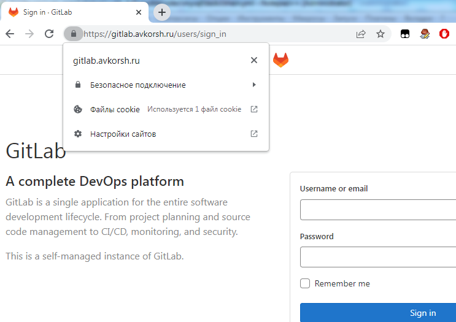  

 __CI/CD__
   
   в основном использовал графический интерфейс. Создал нового пользователя (avkorsh), с произвольным именем, и адобрил доступ из под root, Далее создаем проект, лезем в настройки CI/CD смотрим инстркуцию и token для установки runner на нужном хосте.     
    
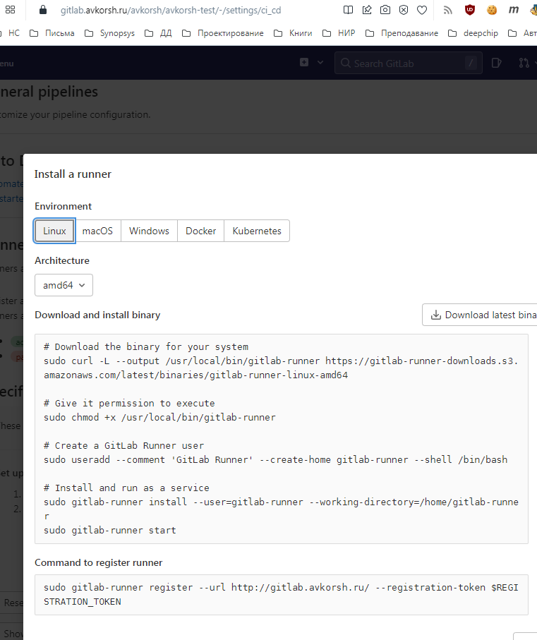  
   
   заходим по ssh на нужный хост: `ssh ubuntu@app` и выполняем инструкцию. Есть проблемы именем хоста для регистрации использовал внутреннее имя `http://gitlab` , однако при настройке pipeline были ошибки доступа и пришлось прописать внутренний адрес в hosts
 
   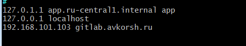  
   
   также пришлось создать и добавить в sudoers пользователя gitlab-runner

   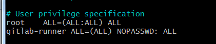  
   
   Далее на хосте app создал репозитарий с исходником wordpress в нем стандартные команды git (init, add, commit, push). Также создале файл `.gitlab-ci.yml`
   
   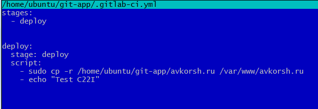  
   
   Также снял с ветки main статус protected конвейер отработал. Скопировал папку в /var/www/avkorsh.ru (я неправильно происал целевой путь, но в так даже нагляднее)
      
   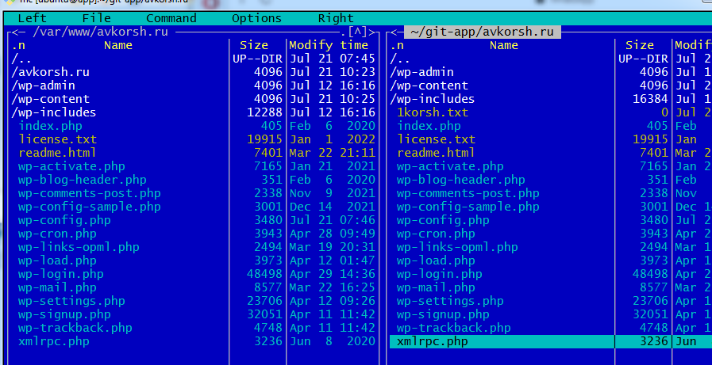     
   
   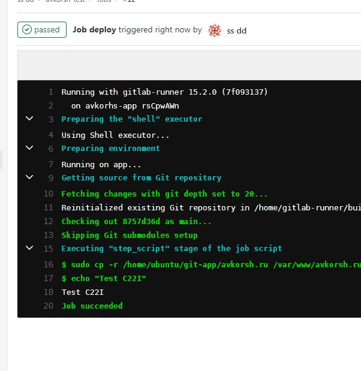     

___


### Установка Prometheus, Alert Manager, Node Exporter и Grafana

Необходимо разработать Ansible роль для установки Prometheus, Alert Manager и Grafana.

Рекомендации:
  - Имя сервера: `monitoring.you.domain`
  - Характеристики: 4vCPU, 4 RAM, Internal address.

Цель:

1. Получение метрик со всей инфраструктуры.

Ожидаемые результаты:

1. Интерфейсы Prometheus, Alert Manager и Grafana доступены по https.
2. В вашей доменной зоне настроены A-записи на внешний адрес reverse proxy:
  - `https://grafana.you.domain` (Grafana)
  - `https://prometheus.you.domain` (Prometheus)
  - `https://alertmanager.you.domain` (Alert Manager)
3. На сервере `you.domain` отредактированы upstreams для выше указанных URL и они смотрят на виртуальную машину на которой установлены Prometheus, Alert Manager и Grafana.
4. На всех серверах установлен Node Exporter и его метрики доступны Prometheus.
5. У Alert Manager есть необходимый [набор правил](https://awesome-prometheus-alerts.grep.to/rules.html) для создания алертов.
2. В Grafana есть дашборд отображающий метрики из Node Exporter по всем серверам.
3. В Grafana есть дашборд отображающий метрики из MySQL (*).
4. В Grafana есть дашборд отображающий метрики из WordPress (*).

*Примечание: дашборды со звёздочкой являются опциональными заданиями повышенной сложности их выполнение желательно, но не обязательно.*


__Ответ:__

1. Для все хостов использовал одинаковую отдельную роль для node_exporter, то есть для всех хостов обычно использовалась основная роль и node_exporter

```yaml
  roles:
   - wordpress
   - nodeexporter
```

2. Для роли prometheus в конфиге явно указаны внутренние имена хостов (monitoring это localhost) :

```
 static_configs:
    - targets:
      - localhost:9100
      - gitlab:9100
      - nginx:9100
      - app:9100
      - db01:9100
      - db02:9100
```

3.  Доменные записи прописываются terraform, сертификат содержит данные имена. В настройки прокси для узла  monitoring сложнее:
```
upstream grafana {
    server monitoring:3000;
}
upstream prometheus {
    server monitoring:9090;
}
upstream alertmanager {
    server monitoring:9093;
}

server {
  listen          443 ssl;
  server_name     alertmanager.avkorsh.ru;
  ssl_certificate      /etc/letsencrypt/live/avkorsh.ru/fullchain.pem;
  ssl_certificate_key  /etc/letsencrypt/live/avkorsh.ru/privkey.pem;
  include              /etc/letsencrypt/options-ssl-nginx.conf;
  location / {
    proxy_pass         http://alertmanager;
...
# и так далее 
```

скрины:

Prometheus с источниками:

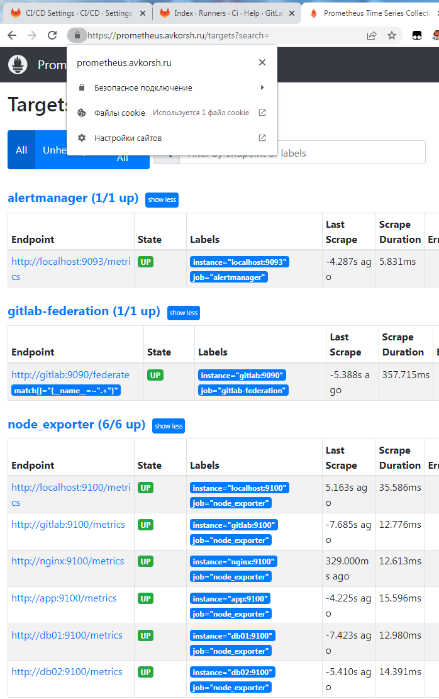     

Grafana заглавная страница

     

Grafana - dashboard

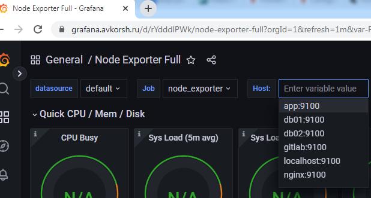     

Alertmanager - заглавная страница

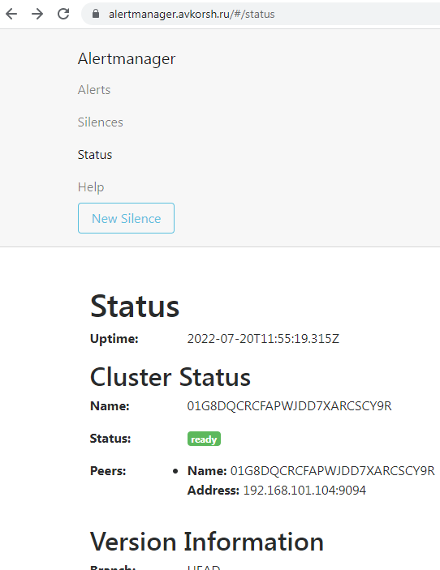     

Alertmanager - срабатывание

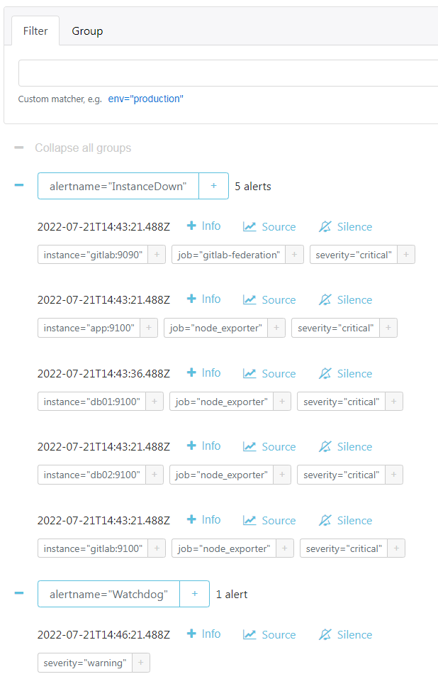  

---
## Что необходимо для сдачи задания?

1. Репозиторий со всеми Terraform манифестами и готовность продемонстрировать создание всех ресурсов с нуля.
2. Репозиторий со всеми Ansible ролями и готовность продемонстрировать установку всех сервисов с нуля.
3. Скриншоты веб-интерфейсов всех сервисов работающих по HTTPS на вашем доменном имени.
  - `https://www.you.domain` (WordPress)
  - `https://gitlab.you.domain` (Gitlab)
  - `https://grafana.you.domain` (Grafana)
  - `https://prometheus.you.domain` (Prometheus)
  - `https://alertmanager.you.domain` (Alert Manager)
4. Все репозитории рекомендуется хранить на одном из ресурсов ([github.com](https://github.com) или [gitlab.com](https://gitlab.com)).

---
